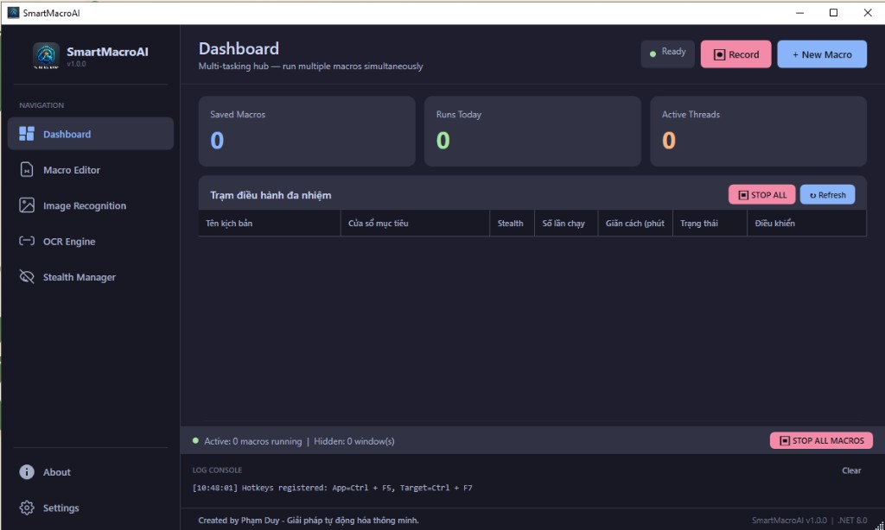

<div align="center">


# SmartMacroAI

### 🤖 Enterprise-grade RPA Automation Tool for Windows

**Tự động hóa mọi thứ. Hoàn toàn tàng hình.**

[](https://github.com/TroniePh/SmartMacroAI/releases)
[](https://github.com/TroniePh/SmartMacroAI)
[](https://dotnet.microsoft.com/)
[](LICENSE)
[](https://github.com/TroniePh/SmartMacroAI/releases)

<br/>

[**⬇️ Tải về miễn phí**](https://github.com/TroniePh/SmartMacroAI/releases/latest) &nbsp;·&nbsp;
[**📖 Hướng dẫn sử dụng**](#-hướng-dẫn-sử-dụng) &nbsp;·&nbsp;
[**🐛 Báo lỗi**](https://github.com/TroniePh/SmartMacroAI/issues) &nbsp;·&nbsp;
[**💬 Hỗ trợ Facebook**](https://www.facebook.com/neull)

</div>

---

## 📸 Giao diện phần mềm

<div align="center">



*Dashboard — Trạm điều hành đa nhiệm: chạy nhiều kịch bản song song trên các cửa sổ khác nhau cùng lúc*

</div>

---

## 🎯 SmartMacroAI là gì?

**SmartMacroAI** là một công cụ **RPA (Robotic Process Automation)** chuyên nghiệp dành cho Windows, cho phép bạn tạo và thực thi các kịch bản tự động hóa mà **không cần viết một dòng code nào**.

Điểm đặc biệt nhất: SmartMacroAI sử dụng **Win32 API** (`PostMessage`, `SendMessage`) để tương tác trực tiếp với cửa sổ ứng dụng ở chế độ nền — **chuột và bàn phím của bạn hoàn toàn tự do** trong khi bot đang chạy.

> 💡 **Dùng để làm gì?** Game automation, form filling, data entry, web scraping, kiểm thử phần mềm, và mọi tác vụ lặp lại khác trên Windows.

---

## ✨ Tính năng nổi bật

<table>
<tr>
<td width="50%">

### 👻 Stealth Engine
Chạy ngầm 100% — ẩn hoàn toàn cửa sổ mục tiêu khỏi thanh taskbar, trả lại chuột và bàn phím cho bạn làm việc khác. Hotkey toàn cục để ẩn/hiện tức thì.

</td>
<td width="50%">

### 🧠 Vision AI & OCR
Nhận diện hình ảnh bằng **Emgu.CV (OpenCV)** và đọc văn bản bằng **Tesseract OCR** từ cửa sổ nền. Click chính xác vào đúng vị trí hình ảnh tìm thấy — không cần tọa độ tĩnh.

</td>
</tr>
<tr>
<td width="50%">

### 🎥 Smart Recorder
Ghi lại toàn bộ thao tác chuột và bàn phím của bạn, tự động tính delay giữa các hành động y như người thật. Chỉ cần thao tác một lần, bot lặp lại mãi mãi.

</td>
<td width="50%">

### 📊 Multi-tasking Dashboard
Chạy nhiều kịch bản macro song song trên các cửa sổ khác nhau cùng lúc. Mỗi macro có thread riêng, Start/Stop độc lập, không giật lag.

</td>
</tr>
<tr>
<td width="50%">

### 🌐 Web Automation (Playwright)
Tích hợp **Microsoft Playwright** để tự động hóa trình duyệt web: điều hướng URL, click CSS selector, nhập văn bản vào form — kết hợp liền mạch với Desktop automation.

</td>
<td width="50%">

### 🔄 Update Checker
Tự động kiểm tra phiên bản mới từ GitHub khi khởi động. Nếu có bản mới, thông báo ngay và mở trang tải về. Chưa bao giờ bị lỡ bản cập nhật.

</td>
</tr>
</table>

---

## 🛠️ Các loại Action hỗ trợ

| Icon | Loại Action | Mô tả |
|:----:|-------------|-------|
| 🖱️ | **Click** | Gửi click trái/phải đến tọa độ (X, Y) trong cửa sổ |
| ⌨️ | **Type** | Gõ văn bản trực tiếp vào cửa sổ mục tiêu |
| ⏱️ | **Wait** | Dừng lại N mili-giây trước khi thực hiện bước tiếp theo |
| 🖼️ | **IF Image Found** | Tìm hình ảnh mẫu trong cửa sổ, tự động click nếu tìm thấy |
| 🔤 | **IF Text Found** | Đọc text bằng OCR, thực hiện hành động khi tìm thấy chuỗi ký tự |
| 🌐 | **Web: Navigate** | Điều hướng trình duyệt Playwright đến URL |
| 🌐 | **Web: Click** | Click vào element bằng CSS Selector |
| 🌐 | **Web: Type** | Nhập văn bản vào input field bằng CSS Selector |

---

## 🚀 Cài đặt & Sử dụng

### Yêu cầu hệ thống

| Yêu cầu | Chi tiết |
|---------|---------|
| **Hệ điều hành** | Windows 10 / Windows 11 (64-bit) |
| **Quyền hạn** | Administrator (UAC prompt sẽ hiện khi khởi động) |
| **RAM** | Tối thiểu 4 GB (khuyến nghị 8 GB) |
| **Ổ cứng** | ~500 MB (bao gồm Playwright Chromium) |
| **Mạng** | Cần kết nối internet lần đầu để tải Playwright browser |

### ⬇️ Cài đặt

**Cách 1 — Dùng Installer (Khuyến nghị)**

1. Tải file `SmartMacroAI_Setup_v1.2.2.exe` từ [**Releases**](https://github.com/TroniePh/SmartMacroAI/releases/latest)
2. Chạy file installer, làm theo hướng dẫn trên màn hình
3. Installer sẽ **tự động tải và cài Playwright Chromium** sau khi cài app (cần ~1-2 phút)
4. Shortcut Desktop và Start Menu được tạo tự động
5. Khởi chạy `SmartMacroAI.exe` — chấp nhận UAC prompt

**Cách 2 — Build từ source**

```bash
# Clone repository
git clone https://github.com/TroniePh/SmartMacroAI.git
cd SmartMacroAI

# Restore & Build
dotnet restore
dotnet publish -c Release -r win-x64 --self-contained true -o publish/win-x64

# Chạy app
./publish/win-x64/SmartMacroAI.exe
```

**Build installer (.exe cài đặt) trên máy Windows**

1. Cài [Inno Setup 6](https://jrsoftware.org/isdl.php).
2. Publish bản self-contained vào thư mục `release_output` (cùng tên với script):

```powershell
dotnet publish SmartMacroAI.csproj -c Release -r win-x64 --self-contained true `
  -p:PublishSingleFile=true -p:EnableCompressionInSingleFile=true `
  -p:IncludeNativeLibrariesForSelfExtract=true -o ./release_output
```

3. Biên dịch script (tuỳ chọn chỉ định phiên bản, ví dụ `1.2.2`):

```powershell
& "${env:ProgramFiles(x86)}\Inno Setup 6\ISCC.exe" installer\SmartMacroAI_Setup.iss /DMyAppVersion=1.2.2
```

4. File cài đặt nằm tại `installer_out\SmartMacroAI_Setup_v1.2.2.exe`.

---

## 📖 Hướng dẫn sử dụng

### Bước 1 — Tạo kịch bản mới

1. Mở SmartMacroAI → vào **Macro Editor**
2. Nhập tên kịch bản vào ô **Macro Name**
3. Chọn **cửa sổ mục tiêu** từ dropdown (nhấn ↻ để làm mới danh sách)

### Bước 2 — Thêm Actions

Kéo các khối action từ **Toolbox** vào canvas, hoặc click vào khối để thêm:

```
[Toolbox]                    [Canvas - Kịch bản của bạn]
─────────────────            ──────────────────────────────
🖱️ Click          →          [0] IF Image Found: login_btn.png 🎯 (Auto-Click)
⌨️ Type           →          [1] Wait 500ms
⏱️ Wait           →          [2] Type: "hello@example.com"
🖼️ IF Image Found →          [3] Click (200, 350)
🌐 Web: Navigate  →          [4] Web: Navigate → https://example.com
```

Double-click vào bất kỳ action nào để **chỉnh sửa thông số**.

### Bước 3 — Bật Stealth Mode & Chạy

1. Vào **Stealth Manager** → Toggle "Stealth" cho cửa sổ mục tiêu để ẩn nó
2. Quay về **Dashboard** → nhấn **▶ Start** trên dòng kịch bản
3. Bot bắt đầu chạy ngầm — cửa sổ mục tiêu đã ẩn nhưng vẫn nhận được clicks!
4. Nhấn **⏹ Stop** để dừng bất kỳ lúc nào, hoặc **STOP ALL MACROS** để dừng tất cả

### Bước 4 — Hotkeys toàn cục

| Hotkey mặc định | Chức năng |
|----------------|-----------|
| `Ctrl + F5` | Ẩn/hiện cửa sổ SmartMacroAI |
| `Ctrl + F7` | Ẩn/hiện cửa sổ mục tiêu đang chọn |

> ⚙️ Tùy chỉnh hotkey trong **Settings → Hotkey Configuration**

---

## 🏗️ Kiến trúc & Công nghệ

```
SmartMacroAI/
├── Core/
│   ├── Win32Api.cs          # P/Invoke: PostMessage, SendMessage, FindWindow...
│   ├── MacroEngine.cs       # Engine thực thi đa luồng (async/await)
│   ├── VisionEngine.cs      # OpenCV template matching + Tesseract OCR
│   ├── PlaywrightEngine.cs  # Web automation với Microsoft Playwright
│   └── MacroRecorder.cs     # Global mouse/keyboard hook recorder
├── Models/
│   ├── MacroAction.cs       # Base + derived action types (JSON polymorphic)
│   ├── MacroScript.cs       # Script model với loop/interval settings
│   └── ScriptManager.cs     # JSON serialization / file management
├── ViewModels/
│   └── DashboardRowVm.cs    # MVVM ViewModel cho Dashboard DataGrid
├── Assets/
│   ├── logo.ico / logo.png
│   └── qr_bank.png
└── installer/
    └── SmartMacroAI_Setup.iss   # Inno Setup 6 — tạo SmartMacroAI_Setup_v*.exe
```

### Tech Stack

| Thành phần | Công nghệ | Mục đích |
|-----------|-----------|---------|
| **UI Framework** | WPF (.NET 8.0) | Giao diện người dùng hiện đại |
| **Desktop Automation** | Win32 API (P/Invoke) | PostMessage, FindWindow, PrintWindow |
| **Image Recognition** | Emgu.CV 4.x (OpenCV) | Template matching cho IF Image Found |
| **Text Recognition** | Tesseract OCR 5.x | Đọc text từ cửa sổ nền |
| **Web Automation** | Microsoft Playwright 1.59 | Browser automation (Chromium) |
| **Serialization** | System.Text.Json | Lưu/đọc kịch bản JSON |
| **Tray Icon** | System.Windows.Forms | NotifyIcon + dynamic context menu |
| **Installer** | Inno Setup 6 | Professional Windows installer |

---

## 🔒 Tại sao "Stealth"?

Hầu hết các tool automation hiện tại **chiếm dụng chuột vật lý** — tức là bạn không thể làm gì khác trong khi bot chạy.

SmartMacroAI hoạt động khác hoàn toàn:

```
❌ Tool thông thường:    Mouse.Move(x, y) → Click()   ← chiếm chuột vật lý
✅ SmartMacroAI:         PostMessage(hwnd, WM_LBUTTONDOWN, ...)  ← gửi thẳng vào process
```

Lệnh `PostMessage` gửi trực tiếp sự kiện vào **message queue** của tiến trình đích — cửa sổ nhận click **mà không cần chuột phải di chuyển**. Bạn vẫn dùng máy tính bình thường trong khi bot đang tự động hóa.

---

## 📦 Releases

| Phiên bản | Ngày | Highlights |
|-----------|------|-----------|
| **v1.2.2** | 04/2026 | ModuleAuditService (phân loại DLL 3 tầng), giảm false positive WPF/.NET |
| **v1.2.1** | 04/2026 | Anti-Detection v1.1, OCR/Variables, bản vá và cải tiến |
| **v1.2.0** | 04/2026 | Chuột Bézier (hardware mode), tab Mouse Settings, GitHub Release |
| **v1.1.1** | 04/2026 | 🔧 Patch · GitHub Actions release pipeline · version bump |
| **v1.1.0** | 04/2026 | 🆕 Admin UAC manifest · 🔄 Auto Update Checker · Humanized ControlClick |
| **v1.0.0** | 04/2026 | 🎉 Ra mắt · Dashboard · Stealth Manager · Playwright Web Engine · Vision AI |

---

## ☕ Ủng hộ tác giả

Phần mềm được phát triển **hoàn toàn miễn phí** và mã nguồn mở.
Nếu SmartMacroAI giúp ích cho công việc của bạn, hãy mời tác giả một ly cà phê!

<div align="center">


**MB Bank · PHAM QUOC DUY · 379997999**

</div>

---

## 🤝 Đóng góp & Phản hồi

- 🐛 **Báo lỗi:** [GitHub Issues](https://github.com/TroniePh/SmartMacroAI/issues)
- 💡 **Đề xuất tính năng:** [GitHub Discussions](https://github.com/TroniePh/SmartMacroAI/discussions)
- 💬 **Hỗ trợ trực tiếp:** [facebook.com/neull](https://www.facebook.com/neull)
- ⭐ **Nếu thấy hữu ích:** Hãy cho một Star trên GitHub!

---

## 📄 License

Distributed under the **MIT License**. See [`LICENSE`](LICENSE) for more information.

---

<div align="center">

Made with ❤️ by **Phạm Duy**

*Created by Phạm Duy — Giải pháp tự động hóa thông minh.*

[](https://www.facebook.com/neull)
[](https://github.com/TroniePh/SmartMacroAI)

</div>
